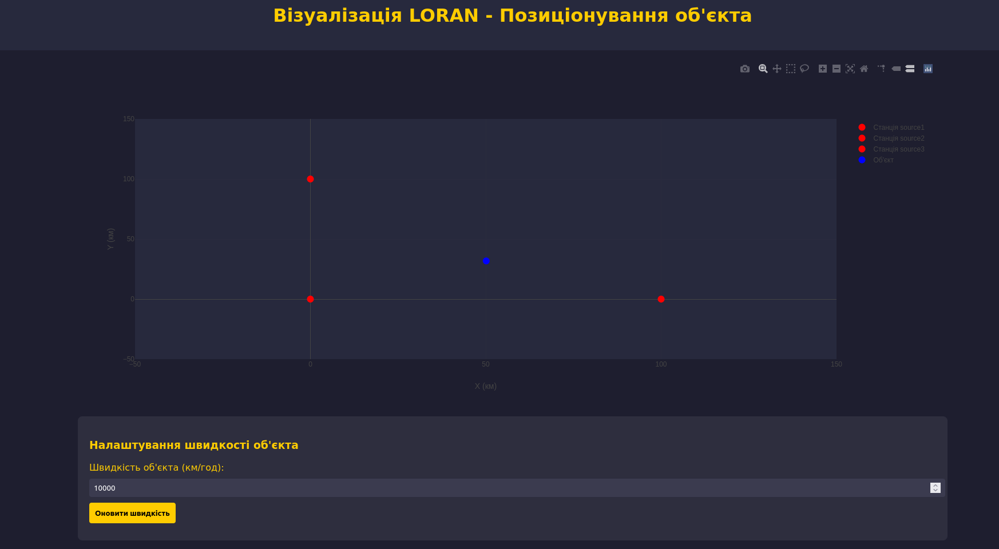

# lab_6
Розробка додатку для візуалізації вимірювань LORAN
Мета роботи
Розробити додаток, який зчитує дані з емульованої вимірювальної частини LORAN,
наданої у вигляді Docker image, та відображає положення об'єкта і базових станцій на
графіку в декартових координатах.

Основні функції сторінки:

1. На сторінці відображається графік, який оновлюється в режимі реального часу. Він показує розташування базових станцій та розраховану позицію об'єкта.

2. Встановлюється з'єднання з WebSocket-сервером (ws://localhost:4002) для отримання даних від базових станцій. Дані містять часові відмітки прийому сигналу з різних станцій.

3. При отриманні достатньої кількості даних (від трьох станцій), проводиться розрахунок позиції об'єкта за допомогою методу різниці часу прибуття та алгоритму найменших квадратів.

4. Після розрахунку позиції об'єкта, графік оновлюється для відображення нової позиції об'єкта разом з базовими станціями. При натисканні кнопки "Оновити швидкість", нове значення швидкості відправляється на сервер через HTTP-запит (POST на http://localhost:4002/config) для оновлення параметрів об'єкта.
